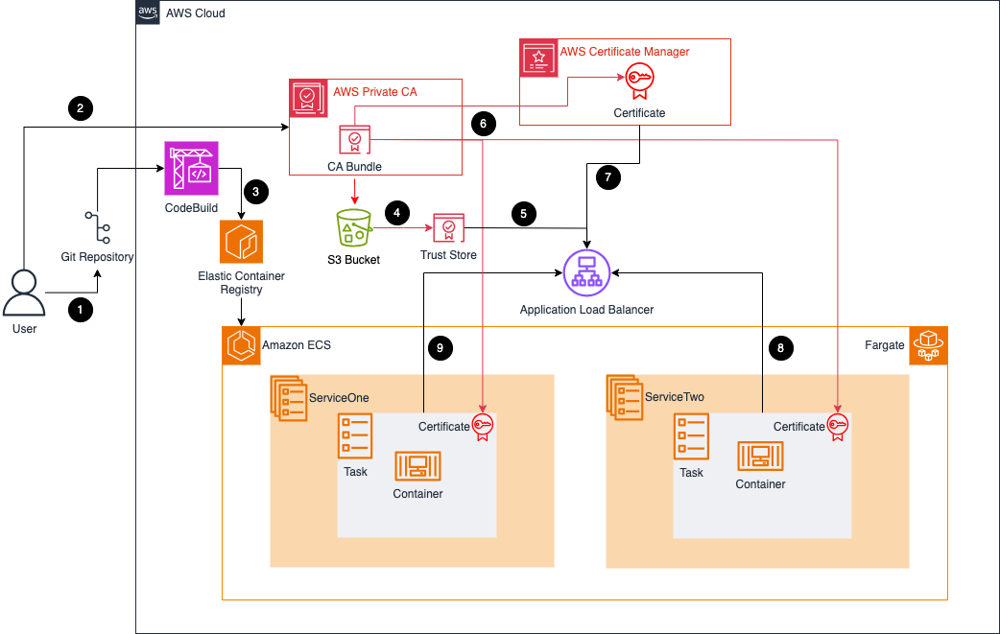

## mTLS with Application Load Balancer in Amazon ECS

This pattern provides guidance for implementing [Mutual Transport Layer Security](https://en.wikipedia.org/wiki/Mutual_authentication) (mTLS) in Amazon Elastic Container Service (Amazon ECS) by using [Application Load Balancer (ALB)](https://docs.aws.amazon.com/elasticloadbalancing/latest/application/mutual-authentication.html) to authenticate X.509 client certificates from AWS Private Certificate Authority (PCA). The pattern use Amazon Elastic Container Registry (Amazon ECR) to store container images.

The pattern helps you to simplify your application authentication and offload security burdens with mutual TLS (mTLS) in Amazon ECS using Application Load Balancer. This powerful combination ensures secure communication between your services, reducing the need for complex authentication mechanisms within your applications.

The example in this pattern uses docker images from public gallery to initially create the sample workloads, and subsequently building new docker images to be stored in Amazon ECR. For the source, consider a Git-based system such as GitHub, GitLab, or Bitbucket, or use Amazon Simple Storage Service (Amazon S3). For building the docker images, consider using AWS CodeBuild for the subsequent images.

## Prerequisites

- [AWS Account](https://signin.aws.amazon.com/signin?redirect_uri=https%3A%2F%2Fportal.aws.amazon.com%2Fbilling%2Fsignup%2Fresume&client_id=signup&code_challenge_method=SHA-256&code_challenge=XEEgw2-l_BhdGq9gejjCnbmOG9-bgXnWTm7f-20KOTk) with an access to deploy CloudFormation stacks.
- Install [AWS CLI](https://docs.aws.amazon.com/cli/latest/userguide/getting-started-install.html) latest version.
- Install [OpenSSL](https://www.openssl.org/)
- Familiarity with AWS services, including Amazon ECS and Fargate
- Knowledge of Docker, NGINX
- AWS Credentials: You will need to configure on your local machine or in your environment by either using the [AWS CLI](https://docs.aws.amazon.com/cli/latest/userguide/welcome-examples.html) or by setting the environment variables in the ~/.aws/credentials file.

## Architecture Diagram

## Steps required

- Create a private [CA in AWS Private CA](https://docs.aws.amazon.com/privateca/latest/userguide/create-CA.html)
- Create and [install your private CA certificate](https://docs.aws.amazon.com/privateca/latest/userguide/PCACertInstall.html)
- Issue private [end-entity certificates](https://docs.aws.amazon.com/privateca/latest/userguide/PcaIssueCert.html)
- Retrieve your [CA certificate from AWS Private CA](https://docs.aws.amazon.com/privateca/latest/userguide/PcaGetCert.html)
- In ACM, [request a private PKI certificate signed by a CA from AWS Private CA](https://docs.aws.amazon.com/acm/latest/userguide/gs-acm-request-private.html#request-private-cli)
- Create Trust store
- Deploy the [CloudFormation template to provision the AWS resources](./apg-infra.yaml)
- Associate the trust store to the ALB provisioned by updating the listeners to enable mtls
- Build your own docker images and push to Amazon ECR
- Create a new revision of the task definition and update the services

## Security

See [CONTRIBUTING](CONTRIBUTING.md#security-issue-notifications) for more information.

## License

This library is licensed under the MIT-0 License. See the LICENSE file.

